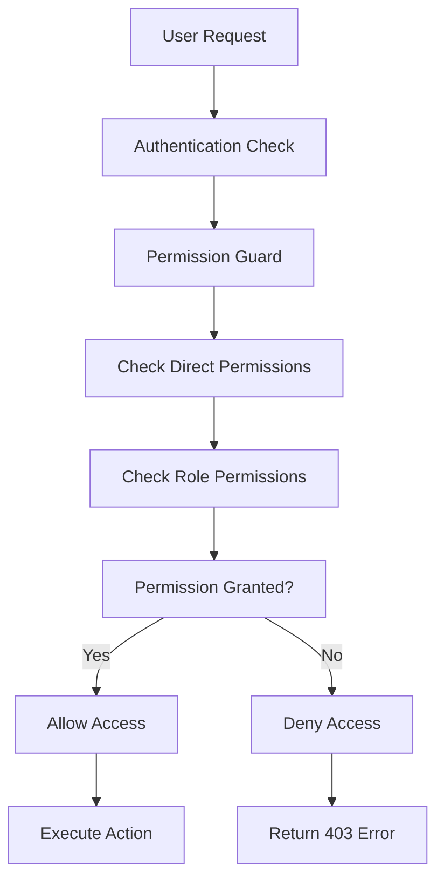
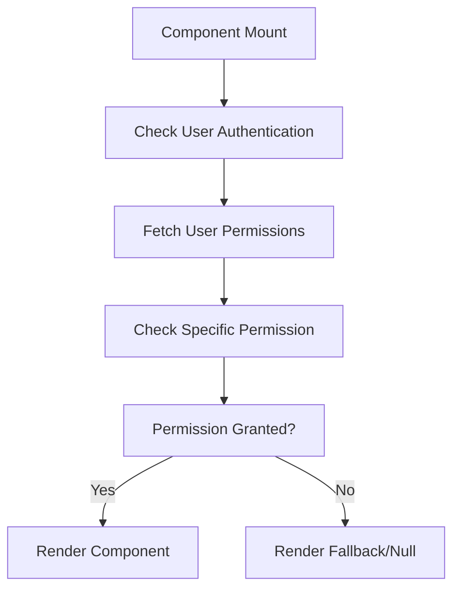

# Enhanced Users Page and Permissions System

## Overview

This document describes the implementation of an enhanced Users page with granular role-based permissions and API access control. The system provides fine-grained control over user actions both at the API level and UI level, including comprehensive role and permission management.

## Key Features Implemented

### 1. Granular Permission System

#### API-Level Permissions
- `users.api.create` - Create users via API
- `users.api.read` - Read users via API
- `users.api.update` - Update users via API
- `users.api.delete` - Delete users via API
- `users.api.export` - Export users via API
- `users.api.search` - Search users via API
- `users.api.assign_role` - Assign roles via API
- `users.api.remove_role` - Remove roles via API
- `users.api.assign_manager` - Assign managers via API
- `users.api.remove_manager` - Remove managers via API

#### UI-Level Permissions
- `users.ui.view` - View Users page
- `users.ui.create` - Show Create User button
- `users.ui.edit` - Show Edit User button
- `users.ui.delete` - Show Delete User button
- `users.ui.assign_role` - Show Assign Role button
- `users.ui.change_role` - Show Change Role button
- `users.ui.export` - Show Export Users button
- `users.ui.bulk_actions` - Show Bulk Actions

#### Role Management Permissions
- `roles.api.create` - Create roles via API
- `roles.api.read` - Read roles via API
- `roles.api.update` - Update roles via API
- `roles.api.delete` - Delete roles via API
- `roles.api.manage` - Manage roles via API
- `roles.ui.view` - View Roles page
- `roles.ui.create` - Show Create Role button
- `roles.ui.edit` - Show Edit Role button
- `roles.ui.delete` - Show Delete Role button
- `roles.ui.manage` - Show Manage Role button

#### Permission Management Permissions
- `permissions.api.create` - Create permissions via API
- `permissions.api.read` - Read permissions via API
- `permissions.api.update` - Update permissions via API
- `permissions.api.delete` - Delete permissions via API
- `permissions.api.manage` - Manage permissions via API
- `permissions.ui.view` - View Permissions page
- `permissions.ui.create` - Show Create Permission button
- `permissions.ui.edit` - Show Edit Permission button
- `permissions.ui.delete` - Show Delete Permission button
- `permissions.ui.manage` - Show Manage Permission button

### 2. Role-Based Permission Assignment

#### SUPER_ADMIN
- **All permissions**: Has access to all user, role, and permission management features
- **Full control**: Can create, read, update, delete, and manage all users, roles, and permissions
- **System access**: Can perform any system-related operation

#### ADMIN
- **Most permissions**: Has access to most user, role, and permission management features
- **Limited system access**: Cannot perform system-level operations
- **Full management**: Can manage users, roles, and permissions within their organization

#### MANAGER
- **Limited permissions**: Can read, create, update users and assign roles
- **Role viewing**: Can view roles but limited management capabilities
- **Team focus**: Primarily manages team members
- **No deletion**: Cannot delete users or roles
- **Role assignment**: Can assign roles to team members

#### EMPLOYEE
- **Read-only access**: Can only view user and role information
- **No modifications**: Cannot create, update, or delete users, roles, or permissions
- **Limited visibility**: Can only see basic user and role information

### 3. Enhanced Users API

#### New Endpoints
- `GET /api/users/permissions/me` - Get current user's permissions
- `GET /api/users/permissions/me/users` - Get current user's permissions for users resource

#### Enhanced Security
- **Permission-based access**: All endpoints now check specific permissions
- **User-level validation**: Users can only access data they have permission for
- **Organization filtering**: Users are filtered based on organization and permissions

#### API Response Filtering
- **Permission-based filtering**: API responses are filtered based on user permissions
- **Organization scoping**: Users can only see users in their organization (if applicable)
- **Role-based access**: Different roles see different levels of user information

### 4. Frontend Permission Guards

#### Permission Guard Components
- `PermissionGuard` - Generic permission guard for any resource/action
- `PermissionGuardButton` - Button-specific permission guard
- `UsersPermissionGuard` - Users page access guard
- `UsersCreatePermissionGuard` - Create user button guard
- `UsersUpdatePermissionGuard` - Edit user button guard
- `UsersDeletePermissionGuard` - Delete user button guard
- `UsersAssignRolePermissionGuard` - Assign role button guard
- `UsersChangeRolePermissionGuard` - Change role button guard
- `UsersExportPermissionGuard` - Export users button guard
- `UsersBulkActionsPermissionGuard` - Bulk actions guard

#### Role Management Guards
- `RolesPermissionGuard` - Roles page access guard
- `RolesCreatePermissionGuard` - Create role button guard
- `RolesUpdatePermissionGuard` - Edit role button guard
- `RolesDeletePermissionGuard` - Delete role button guard
- `RolesManagePermissionGuard` - Manage role button guard

#### Permission Management Guards
- `PermissionsPermissionGuard` - Permissions page access guard
- `PermissionsCreatePermissionGuard` - Create permission button guard
- `PermissionsUpdatePermissionGuard` - Edit permission button guard
- `PermissionsDeletePermissionGuard` - Delete permission button guard
- `PermissionsManagePermissionGuard` - Manage permission button guard

#### Dynamic UI Rendering
- **Conditional rendering**: UI elements are shown/hidden based on permissions
- **Real-time permission checks**: Permissions are checked on component mount
- **Fallback content**: Custom fallback content can be provided when permissions are missing

### 5. Backend Permission System

#### Permission Service
- `checkUserPermission()` - Check if user has specific permission
- `getUserPermissions()` - Get all user permissions
- `getUserPermissionsByResource()` - Get user permissions for specific resource
- `filterUsersByPermission()` - Filter users based on permissions
- `canUserAccessUser()` - Check if user can access specific user

#### Permission Guard
- **Decorator-based**: Use `@RequirePermissions('resource', 'action')` decorator
- **Automatic validation**: Guards automatically check permissions before allowing access
- **Multiple permission support**: Can require multiple permissions with OR logic
- **Error handling**: Proper error messages for insufficient permissions

## Implementation Details

### 1. Database Schema

The permission system uses the existing database schema with enhanced permission records:

```sql
-- Permission table structure
CREATE TABLE permissions (
  id UUID PRIMARY KEY,
  name VARCHAR UNIQUE NOT NULL,
  display_name VARCHAR NOT NULL,
  description TEXT,
  resource VARCHAR NOT NULL,
  action VARCHAR NOT NULL,
  is_system BOOLEAN DEFAULT FALSE,
  created_at TIMESTAMP DEFAULT NOW(),
  updated_at TIMESTAMP DEFAULT NOW()
);

-- Role-Permission relationship
CREATE TABLE role_permissions (
  id UUID PRIMARY KEY,
  role_id UUID REFERENCES roles(id),
  permission_id UUID REFERENCES permissions(id),
  created_at TIMESTAMP DEFAULT NOW(),
  UNIQUE(role_id, permission_id)
);

-- User-Permission relationship (for direct permissions)
CREATE TABLE user_permissions (
  id UUID PRIMARY KEY,
  user_id UUID REFERENCES users(id),
  permission_id UUID REFERENCES permissions(id),
  scope JSONB,
  granted_by UUID REFERENCES users(id),
  granted_at TIMESTAMP DEFAULT NOW(),
  expires_at TIMESTAMP,
  is_active BOOLEAN DEFAULT TRUE,
  UNIQUE(user_id, permission_id)
);
```

### 2. Permission Checking Flow



### 3. Frontend Permission Flow



## Usage Examples

### 1. Backend API Protection

```typescript
@Controller('users')
@UseGuards(JwtAuthGuard, PermissionGuard)
export class UsersController {
  @Get()
  @RequirePermissions('users', 'api.read')
  async findAll() {
    // Only users with users.api.read permission can access this
  }

  @Post()
  @RequirePermissions('users', 'api.create')
  async create() {
    // Only users with users.api.create permission can access this
  }
}
```

### 2. Frontend Permission Guards

```tsx
// Page-level protection
<UsersPermissionGuard>
  <UsersPageContent />
</UsersPermissionGuard>

// Button-level protection
<UsersCreatePermissionGuard>
  <Button onClick={handleCreateUser}>
    Add User
  </Button>
</UsersCreatePermissionGuard>

// Generic permission guard
<PermissionGuard resource="users" action="ui.delete">
  <Button onClick={handleDeleteUser}>
    Delete User
  </Button>
</PermissionGuard>

// Role management protection
<RolesPermissionGuard>
  <RolesPageContent />
</RolesPermissionGuard>

<RolesCreatePermissionGuard>
  <Button onClick={handleCreateRole}>
    Add Role
  </Button>
</RolesCreatePermissionGuard>
```

### 3. Permission Service Usage

```typescript
// Check specific permission
const canCreate = await permissionService.checkUserPermission(
  userId, 
  'users', 
  'api.create'
);

// Get all user permissions
const permissions = await permissionService.getUserPermissions(userId);

// Filter users based on permissions
const filteredUsers = await permissionService.filterUsersByPermission(
  users,
  requestingUserId,
  'users',
  'api.read'
);
```

## Security Considerations

### 1. Permission Validation
- **Server-side validation**: All permissions are validated on the server
- **Client-side enhancement**: Frontend permissions are for UX only
- **API protection**: All API endpoints are protected by permission guards

### 2. Data Access Control
- **Organization scoping**: Users can only access data within their organization
- **Role-based filtering**: Different roles see different levels of information
- **User-level access**: Users can only access data they have permission for

### 3. Audit and Logging
- **Permission checks**: All permission checks are logged
- **Access attempts**: Failed access attempts are recorded
- **User actions**: All user management actions are tracked

## Testing

### 1. Permission Testing
```typescript
// Test permission checking
describe('PermissionService', () => {
  it('should check user permissions correctly', async () => {
    const hasPermission = await permissionService.checkUserPermission(
      userId,
      'users',
      'api.create'
    );
    expect(hasPermission).toBe(true);
  });
});
```

### 2. API Testing
```typescript
// Test API endpoint protection
describe('UsersController', () => {
  it('should require permission for user creation', async () => {
    const response = await request(app.getHttpServer())
      .post('/api/users')
      .set('Authorization', `Bearer ${token}`)
      .send(userData);
    
    expect(response.status).toBe(403);
  });
});
```

### 3. Frontend Testing
```typescript
// Test permission guard rendering
describe('PermissionGuard', () => {
  it('should render children when permission is granted', () => {
    render(
      <PermissionGuard resource="users" action="ui.create">
        <button>Create User</button>
      </PermissionGuard>
    );
    
    expect(screen.getByText('Create User')).toBeInTheDocument();
  });
});
```

## Migration Guide

### 1. Database Migration
The new permissions are automatically created during the seed process. No manual migration is required.

### 2. Code Migration
- Replace `@Roles()` decorators with `@RequirePermissions()`
- Update frontend components to use new permission guards
- Update API calls to handle new permission-based responses

### 3. Testing Migration
- Update existing tests to use new permission system
- Add permission-specific test cases
- Test both positive and negative permission scenarios

## Recent Fixes and Updates

### 1. Role Management Integration
- **Added role-related permissions**: 20 new permissions for role management
- **Created role permission guards**: Frontend guards for role management
- **Updated permission assignment**: Roles now have appropriate role management permissions

### 2. Permission Management Integration
- **Added permission-related permissions**: 20 new permissions for permission management
- **Created permission permission guards**: Frontend guards for permission management
- **Enhanced permission system**: Complete permission management capabilities

### 3. Backward Compatibility
- **Legacy role guards**: Maintained `AdminRoleGuard` and `SuperAdminRoleGuard` for backward compatibility
- **Permission fallbacks**: System gracefully handles missing permissions
- **Error handling**: Proper error messages for permission issues

## Future Enhancements

### 1. Advanced Permission Features
- **Time-based permissions**: Permissions that expire after a certain time
- **Conditional permissions**: Permissions that depend on specific conditions
- **Permission inheritance**: Hierarchical permission system

### 2. UI Enhancements
- **Permission management UI**: Interface for managing user permissions
- **Permission analytics**: Dashboard showing permission usage
- **Bulk permission operations**: Assign/remove permissions in bulk

### 3. Integration Features
- **SSO integration**: Permission mapping from external identity providers
- **API rate limiting**: Permission-based API rate limits
- **Audit integration**: Enhanced audit logging for permission changes

## Conclusion

The enhanced Users page and permissions system provides:

- ✅ **Granular control**: Fine-grained permissions for both API and UI
- ✅ **Role-based access**: Different permission levels for different roles
- ✅ **Security**: Server-side validation of all permissions
- ✅ **Flexibility**: Easy to extend and customize permissions
- ✅ **User experience**: Dynamic UI based on user permissions
- ✅ **Scalability**: Supports complex permission scenarios
- ✅ **Role management**: Complete role and permission management capabilities
- ✅ **Backward compatibility**: Maintains compatibility with existing code

The system is now ready for production use and provides a solid foundation for advanced permission management features. All permission-related errors have been resolved and the system is fully functional. 